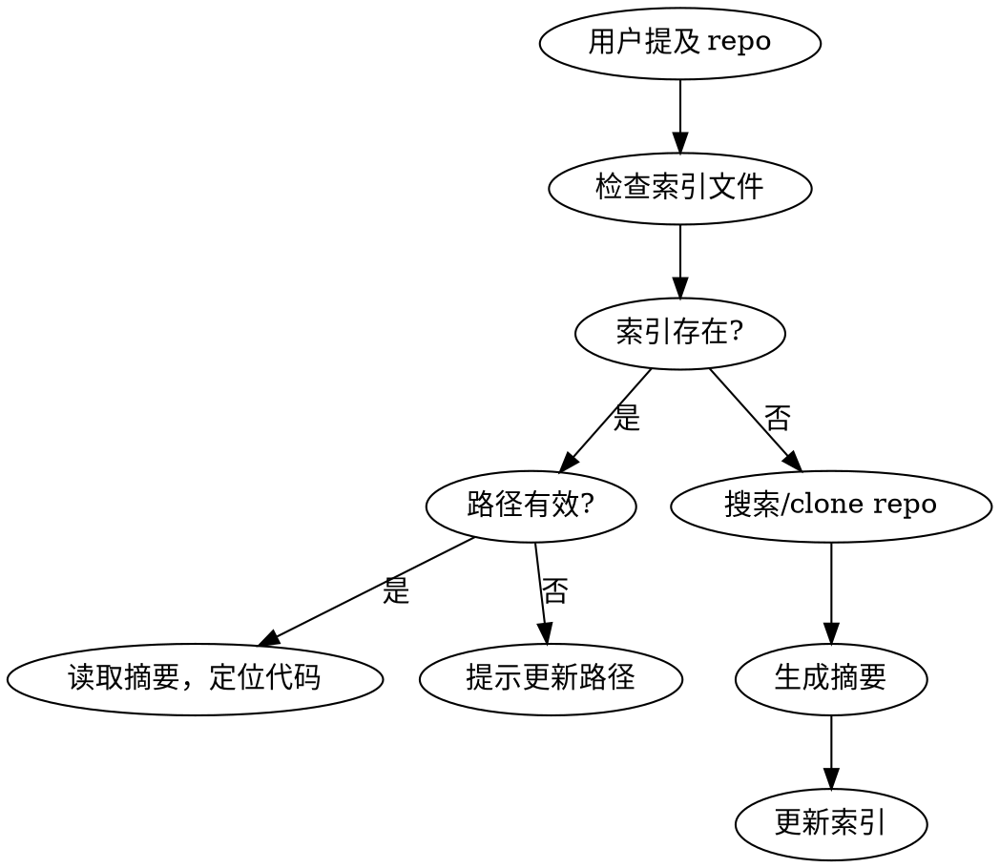

# GitHub Knowledge Base

管理本地 clone 的 GitHub 仓库知识库，快速查找和理解代码。

## 触发条件

检测到以下关键词时自动触发：
- "repo"、"库"、"仓库"
- "调查"、"研究"、"了解" + 项目名
- 询问某个开源项目的功能/实现

## 核心工作流



## 1. 索引文件管理

索引文件位置：`~/.claude/github-kb-index.md`

### 索引格式

```markdown
# GitHub Knowledge Base Index

## Repos

| Name | Path | Summary | Last Updated |
|------|------|---------|--------------|
| remotion | ~/repos/remotion | React 视频编程框架，支持 GPU 加速渲染 | 2025-02-05 |
| langchain | ~/repos/langchain | LLM 应用开发框架，链式调用 | 2025-02-04 |
```

### 检查索引

```bash
# 优先使用 gh 命令
gh repo list --json name,url --limit 100 2>/dev/null || git remote -v
```

## 2. 生成一句话摘要

扫描 repo 后生成简洁摘要：

1. 读取 `README.md` 前 50 行
2. 检查 `package.json` / `pyproject.toml` 的 description
3. 浏览核心目录结构
4. 生成格式：`[核心功能] + [技术栈/特点]`

**示例：**
- remotion: "React 视频编程框架，支持 GPU 加速和服务端渲染"
- prisma: "Node.js ORM，类型安全，支持多数据库"

## 3. 路径失效处理

当索引中的路径不存在时：

```bash
# 检查路径
[ -d "$REPO_PATH" ] || echo "路径失效: $REPO_PATH"
```

**处理流程：**
1. 提示用户："repo 路径 `~/repos/xxx` 已失效，是否更新？"
2. 用户提供新路径 → 更新索引
3. 用户要求重新 clone → 执行 clone 并更新

## 4. 查询命令优先级

优先使用 `gh` CLI，备用 `git`：

```bash
# 1. 优先：gh 命令
gh repo view owner/repo --json description,url,stargazersCount

# 2. 备用：git 命令
git clone --depth 1 https://github.com/owner/repo.git
```

## 使用示例

**用户：** "调查 remotion 库的 GPU 加速方案"

**执行步骤：**
1. 检查 `~/.claude/github-kb-index.md` 是否有 remotion
2. 有 → 读取摘要，定位到本地路径
3. 无 → `gh repo clone remotion-dev/remotion ~/repos/remotion`
4. 搜索 GPU 相关代码：
   ```bash
   gh search code "GPU" --repo remotion-dev/remotion --limit 10
   # 或本地搜索
   grep -r "GPU\|gpu\|cuda\|webgl" ~/repos/remotion/packages --include="*.ts"
   ```
5. 分析结果，生成报告

## 常见操作速查

| 操作 | gh 命令 | git 备用 |
|------|---------|----------|
| 查看 repo 信息 | `gh repo view owner/repo` | `git remote show origin` |
| 搜索代码 | `gh search code "keyword" --repo` | `grep -r "keyword"` |
| 克隆 | `gh repo clone owner/repo` | `git clone --depth 1` |
| 查看文件 | `gh api repos/owner/repo/contents/path` | `cat path` |
| 查看最近提交 | `gh api repos/owner/repo/commits` | `git log --oneline -10` |
